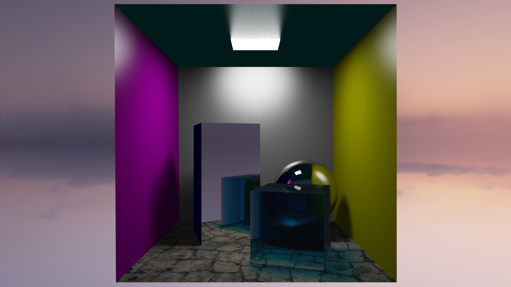

# Computer Graphics - Advanced Hybrid 3D Renderer (C++)

> **2025 Computer Graphics Coursework | Score: TBD 🏆**

An industrial-grade, hybrid 3D rendering engine written in **Modern C++ (C++20)**. This project implements a comprehensive graphics pipeline that seamlessly switches between **Real-Time Rasterization** and **Physically Based Path Tracing**. It demonstrates advanced rendering algorithms including Photon Mapping, Monte Carlo Integration, Normal Mapping, and Depth of Field, built upon a highly optimized, data-oriented architecture.

---

## 🚀 Key Highlights

### 1. Hybrid Rendering Pipeline

A flexible architecture supporting instantaneous mode switching without reloading geometry.

- **Rasterizer:** Features scanline triangle filling with **perspective-correct texture mapping**, Sutherland-Hodgman clipping, and fuzzy depth testing to eliminate Z-fighting in wireframe mode.
- **Path Tracer:** A physically based renderer (PBR) supporting Global Illumination, Area Lights (Soft Shadows), and transparent dielectrics with Fresnel equations.
- **Advanced Optics:** Implemented **Depth of Field (DoF)** using concentric disk sampling to simulate thin-lens cameras with physically accurate Bokeh effects.

### 2. Normal Mapping (Tangent-Space)

A complete implementation of tangent-space normal mapping for adding fine surface details without increasing geometric complexity.

- **Tangent-Space Computation:** Dynamically computes TBN (Tangent-Bitangent-Normal) matrices per-triangle from UV coordinates and edge vectors.
- **Gram-Schmidt Orthogonalization:** Ensures the TBN basis is properly orthonormal, avoiding shading artifacts from degenerate UV mappings.
- **Gamma-Aware Loading:** Applies inverse gamma correction when loading normal maps from sRGB-encoded PPM files (converted from EXR sources that lacked proper library support).
- **Seamless Integration:** Normal perturbations work correctly with both ray tracing (reflection/refraction) and direct lighting calculations.

### 3. High-Performance Engineering

Optimized for maximum CPU throughput using modern C++ techniques.

- **Multi-Threaded Tiling:** The renderer uses `std::jthread` and `std::barrier` to implement a lock-free, tile-based rendering system with Hilbert curve traversal for optimal cache locality.
- **Unified BVH Accelerator:** Implemented a Surface Area Heuristic (SAH) **Bounding Volume Hierarchy (BVH)** used by both the Ray Tracer and Photon Map for $O(\log n)$ intersection queries.
- **Reference-Based BVH Design:** The BVH stores references to geometry vectors rather than pointers, eliminating dangling pointer risks and enabling compile-time safety (non-copyable, non-movable).
- **Photon Tracing**: Multithreaded photon emission allows for rapid caustic map generation without blocking the main UI thread.
- **Memory Optimization:**
  - **Data-Oriented Design:** Geometry is stored in flat global buffers (`World`-centric) with `Face` structs storing indices rather than pointers, significantly improving CPU cache locality.
  - **Custom Containers:** Utilized a custom `InplaceVector` (stack-allocated) to eliminate heap allocation overhead during hot-path polygon clipping, see [std::inplace_vector - cppreference.com](https://en.cppreference.com/w/cpp/container/inplace_vector.html) if you're using C++26 standard.

### 4. Advanced Global Illumination

Features a simplified but effective implementation of **Photon Mapping** to handle complex light transport phenomena.

- **Caustics:** Capable of rendering focused light patterns through refractive objects (e.g., glass spheres).
- **Cone-Targeted Emission:** Photons are emitted within a cone directed at transparent objects, dramatically improving storage efficiency (typically 20%+ hit rate).
- **Optimized Spatial Indexing:** Replaced standard hash maps with a **flattened 1D Grid** for photon storage, ensuring $O(1)$ access and contiguous memory layout for high-performance radiance estimation.

### 5. Physically Based Materials

- **Metallic Surfaces:** Fresnel-weighted reflections with color tinting (supports gold, copper, chrome, iron, brass, etc.).
- **Dielectric Materials:** Full refraction with Beer-Lambert absorption, configurable IOR, and transmission depth.
- **Shading Modes:** Per-object control via `s Flat`, `s Gouraud`, or `s Phong` in OBJ files.

### 6. Post-Processing & Extras

- **ACES Filmic Tone Mapping:** Converts High Dynamic Range (HDR) linear light to displayable sRGB, preserving details in bright highlights.
- **Progressive Accumulation:** Ray traced images refine over time with temporal averaging; camera movement triggers automatic reset.
- **Gamma Correction:** Accurate linear-to-sRGB pipeline with adjustable gamma (default 2.2).
- **Video Export:** Integrated Y4M to MP4 pipeline via `ffmpeg` with 2x2 box-filtered chroma subsampling for high-quality YUV420 encoding.

---

## 🛠 Features Implemented

This renderer implements **ALL** features required for the highest marking band (>75%).

| **Category**      | **Feature**                                           | **Status**    |
| ----------------- | ----------------------------------------------------- | ------------- |
| **Core**          | OBJ/MTL Loading / Multi-model / Camera Control        | ✅ Implemented |
| **Rasterization** | Wireframe / Flat / Texture Mapping / Z-Buffer         | ✅ Implemented |
| **Shading**       | Flat / Gouraud / Phong / Interpolated Normals         | ✅ Implemented |
| **Texturing**     | Diffuse Texture / **Normal Mapping (Tangent-Space)**  | ✅ Implemented |
| **Shadows**       | Hard Shadows / **Soft Shadows (Area Light)**          | ✅ Implemented |
| **Materials**     | Mirror Reflection / **Refraction (Glass)** / Metallic | ✅ Implemented |
| **Advanced**      | **Photon Mapping (Caustics)**                         | ✅ Implemented |
| **Advanced**      | **Depth of Field (Bokeh)**                            | ✅ Implemented |
| **Advanced**      | Environment Mapping (HDR)                             | ✅ Implemented |
| **Advanced**      | BVH Acceleration (SAH-based)                          | ✅ Implemented |

---

## 📸 Gallery

### Physically Based Path Tracing



### Depth of Field & Bokeh

> Demonstrating Thin-Lens Simulation with adjustable Aperture and Focal Distance.
>
> (Place your DoF image here)

### Caustics via Photon Mapping

> Demonstrating light focusing through dielectric spheres.
>
> (Place an image showing caustics here)

### Normal Mapping

> High-frequency surface detail on a textured floor using tangent-space normal maps.
>
> (Place a normal mapping comparison image here)

---

## 🎮 Controls

The renderer supports real-time interaction even during ray tracing (progressive accumulation resets on movement).

| Key | Action |
|-----|--------|
| `1` | Wireframe Mode |
| `2` | Rasterized Mode |
| `3` | Ray Tracing Mode |
| `4` | Depth of Field Mode |
| `5` | Photon Visualization Mode |
| `W/A/S/D` | Move Camera |
| `Space/C` | Move Up/Down |
| `Q/E` | Roll Camera |
| `Mouse Drag` | Look Around |
| `O` | Toggle Orbit Mode |
| `Scroll` | Adjust Focal Distance (DoF mode) |
| `+/-` | Adjust Aperture Size (DoF mode) |
| `G` | Toggle Gamma (1.0 / 2.2) |
| `V` | Toggle Offline Render Mode (64 samples/frame) |
| `N` | Toggle Normal Debug View |
| `P` | Toggle Caustics |
| `Ctrl+S` | Save Screenshot (PPM) |
| `Ctrl+R` | Start/Stop Video Recording |

---

## 💻 Usage

### 🏫 Lab Environment Setup

This project leverages **C++20** features (e.g., `std::barrier`, `std::jthread`). If running on University Lab machines, you **MUST** load a modern GCC version before compiling:

```bash
module add gcc/13.4.0
```

### 🔨 Building the Project

Use CMake to build the project in Release mode for optimal rendering performance:

```bash
cmake -Bbuild -DCMAKE_BUILD_TYPE=Release

# On lab machines, run this
cmake -Bbuild -DCMAKE_BUILD_TYPE=Release -DCMAKE_CXX_COMPILER=/opt/gcc/13.4.0/bin/g++
```

Then compile to the build directory:

```bash
cmake --build build -j$(nproc) --clean-first
```

### 🚀 Running the Renderer

The renderer accepts OBJ models, custom scene description files (`.txt`), and HDR environment maps as command-line arguments.

```bash
./build/CG-CW <scene_file> [additional_files...] [environment.hdr]
```

---

## 📁 Example Scenes

The `model` directory contains several pre-configured scenes demonstrating different features:

### 🎯 Cornell Box with Textured Floor & Normal Mapping

**Recommended for testing Normal Mapping and Caustics.**

```bash
# Full scene with brass sphere and normal-mapped floor
./build/CG-CW ./model/cornell-box/scene.obj ./model/cornell-box/sphere_brass.obj ./model/qwantani_dusk_2_puresky_4k.hdr

# Or the equilvalent txt format (environment is included in scene.txt)
./build/CG-CW ./model/cornell-box/scene.txt ./model/cornell-box/sphere_brass.txt
```

- Press `3` to switch to Ray Tracing mode
- Press `P` to enable Caustics (wait for photon map to build)
- Press `N` to toggle normal debug view (visualize surface normals)

### 🔩 Metal Gallery

**Demonstrates various metallic materials (gold, copper, chrome, iron).**

```bash
./build/CG-CW ./model/metal-gallery/scene.txt
```

- Compare Fresnel reflections across different metal types
- Environment map reflections visible on metallic surfaces

### 💎 Transparency Gallery

**Demonstrates glass, diamond, and clear dielectric materials with refraction.**

```bash
./build/CG-CW ./model/transparency-gallery/scene.txt
```

- Press `3` for Ray Tracing to see refraction
- Press `P` to enable Caustics
- Observe light focusing patterns on the floor and on the ceiling

### 💡 Light Gallery

**Simple scene for testing area light, soft shadows and gradual fading into nothingness created by the multiple reflections of mirrors placed opposite each other**

```bash
./build/CG-CW ./model/light-gallery/scene.txt
```

---

## 🔧 Scene File Format

The renderer supports a custom `.txt` scene format in addition to standard OBJ/MTL.

### Material Properties (in `.txt` or `.mtl`)

| Property | Description | Example |
|----------|-------------|---------|
| `Kd r g b` | Diffuse color | `Kd 0.8 0.2 0.2` |
| `Ks r g b` | Specular color | `Ks 1.0 1.0 1.0` |
| `Ns value` | Shininess (Phong exponent) | `Ns 512` |
| `Mt value` | Metallic factor (0-1) | `Mt 1.0` |
| `Tw value` | Transparency/transmission (0-1) | `Tw 0.95` |
| `Ni value` | Index of Refraction | `Ni 1.5` |
| `Td value` | Transmission depth | `Td 2.0` |
| `Ke r g b` | Emission (for area lights) | `Ke 10 10 10` |
| `map_Kd file` | Diffuse texture | `map_Kd texture.ppm` |
| `map_Bump file` | Normal map | `map_Bump normal.ppm` |

### Shading Mode (in OBJ files)

```
s Flat      # Flat shading (faceted)
s Gouraud   # Gouraud shading (vertex color interpolation)
s Phong     # Phong shading (normal interpolation)
```

---

## 📋 Technical Notes

### Normal Map Loading

Normal maps are expected in tangent-space format. Since the original EXR normal maps were converted to PPM using online tools (lacking proper EXR library support), gamma correction was inadvertently applied. The loader automatically applies inverse gamma (2.2) to recover linear normal values.

### Photon Map Performance

The photon map is built asynchronously on a background thread. Progress is displayed in the console. Typical build time is 0.1-0.5 seconds for 50,000 stored photons. It may goes up to 10 seconds if there are multiple refractive objects placed on the scene which significantly enlarge the bounding box of them. The renderer remains interactive during photon tracing.

### Video Recording

Press `Ctrl+R` to start and stop recording. The renderer captures at the current resolution and converts to MP4 via `ffmpeg` upon stopping. Ensure `ffmpeg` is available in your PATH.

---

*Created by Zik Zhao | University of Bristol, 2025*