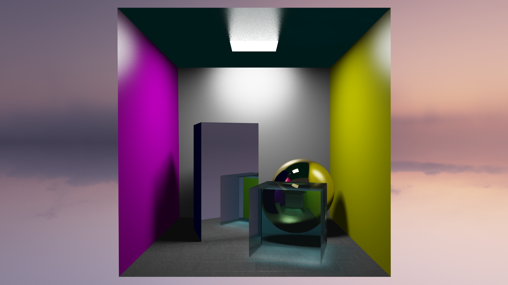
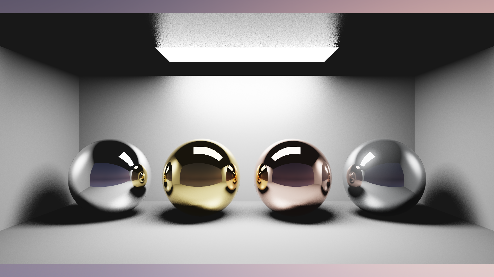
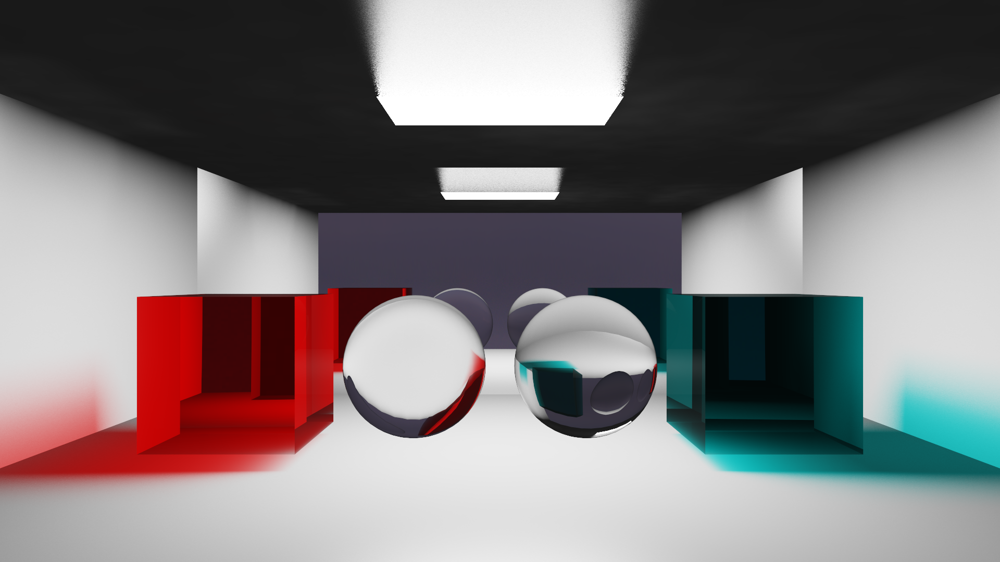
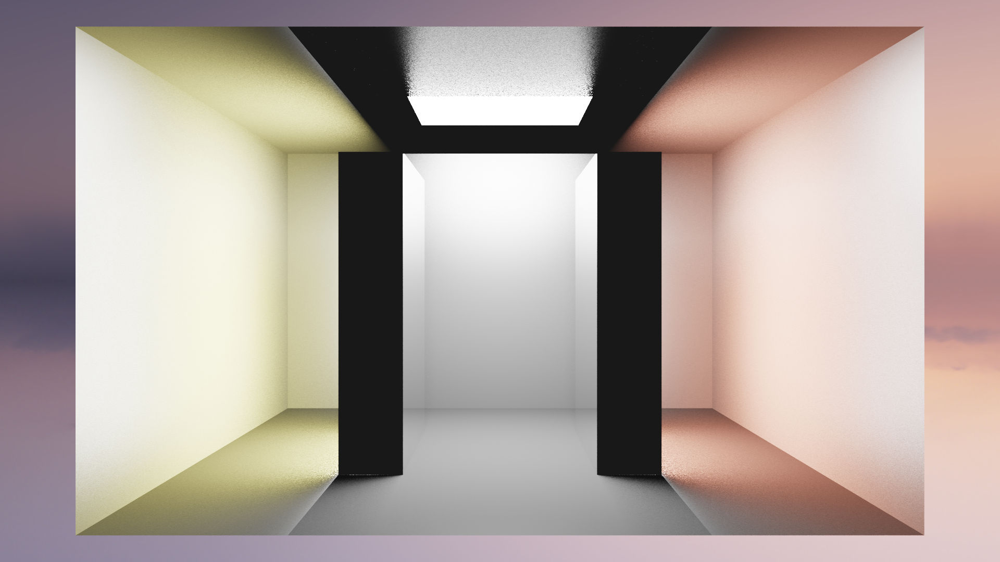
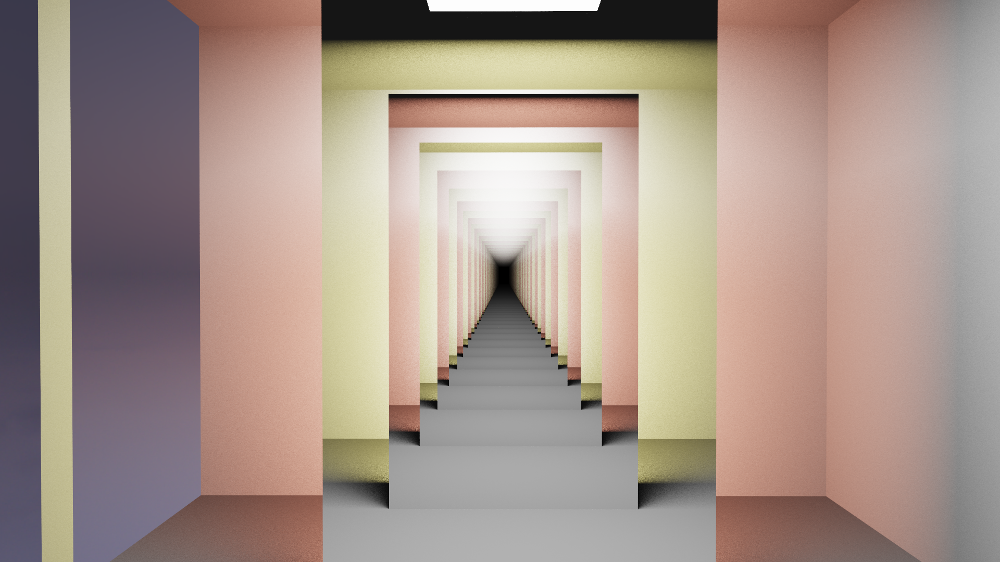

# Computer Graphics - Advanced Hybrid 3D Renderer (C++)

> **2025 Computer Graphics Coursework | Score: TBD 🏆**

An industrial-grade, hybrid 3D rendering engine written in **Modern C++ (C++20)**. This project implements a comprehensive graphics pipeline that seamlessly switches between **Real-Time Rasterization** and **Physically Based Path Tracing**. It demonstrates advanced rendering algorithms including Photon Mapping, Monte Carlo Integration, Normal Mapping, and Depth of Field, built upon a highly optimized, data-oriented architecture.

---

## 🚀 Key Highlights

### 1. Hybrid Rendering Pipeline

A flexible architecture supporting instantaneous mode switching without reloading geometry.

- **Rasterizer:** Features scanline triangle filling with **perspective-correct texture mapping**, Sutherland-Hodgman clipping, and fuzzy depth testing to eliminate Z-fighting in wireframe mode.
- **Path Tracer:** A physically based renderer (PBR) supporting Global Illumination, Area Lights (Soft Shadows), and transparent dielectrics with Fresnel equations.
- **Advanced Optics:** Implemented **Depth of Field (DoF)** using concentric disk sampling to simulate thin-lens cameras with physically accurate Bokeh effects.

### 2. Normal Mapping (Tangent-Space)

A complete implementation of tangent-space normal mapping for adding fine surface details without increasing geometric complexity.

- **Tangent-Space Computation:** Dynamically computes TBN (Tangent-Bitangent-Normal) matrices per-triangle from UV coordinates and edge vectors.
- **Gram-Schmidt Orthogonalization:** Ensures the TBN basis is properly orthonormal, avoiding shading artifacts from degenerate UV mappings.
- **Gamma-Aware Loading:** Applies inverse gamma correction when loading normal maps from sRGB-encoded PPM files (converted from EXR sources that lacked proper library support).
- **Seamless Integration:** Normal perturbations work correctly with both ray tracing (reflection/refraction) and direct lighting calculations.

### 3. High-Performance Engineering

Optimized for maximum CPU throughput using modern C++ techniques.

- **Multi-Threaded Tiling:** The renderer uses `std::jthread` and `std::barrier` to implement a lock-free, tile-based rendering system with Hilbert curve traversal for optimal cache locality.
- **Unified BVH Accelerator:** Implemented a Surface Area Heuristic (SAH) **Bounding Volume Hierarchy (BVH)** used by both the Ray Tracer and Photon Map for $O(\log n)$ intersection queries.
- **Reference-Based BVH Design:** The BVH stores references to geometry vectors rather than pointers, eliminating dangling pointer risks and enabling compile-time safety (non-copyable, non-movable).
- **Photon Tracing**: Multithreaded photon emission allows for rapid caustic map generation without blocking the main UI thread.
- **Memory Optimization:**
  - **Data-Oriented Design:** Geometry is stored in flat global buffers (`World`-centric) with `Face` structs storing indices rather than pointers, significantly improving CPU cache locality.
  - **Custom Containers:** Utilized a custom `InplaceVector` to simulate C++26 `std::inplace_vector` behavior, ensuring stack-based storage to eliminate heap allocation overhead during hot-path polygon clipping.

### 4. Advanced Global Illumination

Features a simplified but effective implementation of **Photon Mapping** to handle complex light transport phenomena.

- **Caustics:** Capable of rendering focused light patterns through refractive objects (e.g., glass spheres).
- **Cone-Targeted Emission:** Photons are emitted within a cone directed at transparent objects, dramatically improving storage efficiency (typically 20%+ hit rate).
- **Optimized Spatial Indexing:** Replaced standard hash maps with a **flattened 1D Grid** for photon storage, ensuring $O(1)$ access and contiguous memory layout for high-performance radiance estimation.

### 5. Physically Based Materials

- **Metallic Surfaces:** Fresnel-weighted reflections with color tinting (supports gold, copper, chrome, iron, brass, etc.).
- **Dielectric Materials:** Full refraction with Beer-Lambert absorption, configurable IOR, and transmission depth.
- **Shading Modes:** Per-object control via `s Flat`, `s Gouraud`, or `s Phong` in OBJ files.

### 6. Post-Processing & Extras

- **ACES Filmic Tone Mapping:** Converts High Dynamic Range (HDR) linear light to displayable sRGB, preserving details in bright highlights.
- **Progressive Accumulation:** Ray traced images refine over time with temporal averaging; camera movement triggers automatic reset.
- **Gamma Correction:** Accurate linear-to-sRGB pipeline with adjustable gamma (default 2.2).
- **Video Export:** Integrated Y4M to MP4 pipeline via `ffmpeg` with 2x2 box-filtered chroma subsampling for high-quality YUV420 encoding.

---

## 🛠 Features Implemented

This renderer implements **ALL** features required for the highest marking band (>75%).

| **Category**      | **Feature**                                           | **Status**    |
| ----------------- | ----------------------------------------------------- | ------------- |
| **Core**          | OBJ/MTL Loading / Multi-model / Camera Control        | ✅ Implemented |
| **Rasterization** | Wireframe / Flat / Texture Mapping / Z-Buffer         | ✅ Implemented |
| **Shading**       | Flat / Gouraud / Phong / Interpolated Normals         | ✅ Implemented |
| **Texturing**     | Diffuse Texture / **Normal Mapping** / Texture Tiling  | ✅ Implemented |
| **Shadows**       | Hard Shadows / **Soft Shadows (Area Light)**          | ✅ Implemented |
| **Materials**     | Mirror Reflection / **Refraction (Glass)** / Metallic | ✅ Implemented |
| **Advanced**      | **Photon Mapping (Caustics)**                         | ✅ Implemented |
| **Advanced**      | **Depth of Field (Bokeh)**                            | ✅ Implemented |
| **Advanced**      | Environment Mapping (HDR)                             | ✅ Implemented |
| **Advanced**      | BVH Acceleration (SAH-based)                          | ✅ Implemented |

---

## 🎬 Demo Video

<video src="./assets/ident.mp4" controls width="100%"></video>

---

## 🎮 Controls

The renderer supports real-time interaction even during ray tracing (progressive accumulation resets on movement).

| Key | Action |
|-----|--------|
| `1` | Wireframe Mode |
| `2` | Rasterized Mode |
| `3` | Ray Tracing Mode |
| `4` | Depth of Field Mode |
| `5` | Photon Visualization Mode |
| `W/A/S/D` | Move Camera |
| `Space/C` | Move Up/Down |
| `Q/E` | Roll Camera |
| `Mouse Drag` | Look Around |
| `O` | Toggle Orbit Mode |
| `Scroll` | Adjust Focal Distance (DoF mode) |
| `+/-` | Adjust Aperture Size (DoF mode) |
| `G` | Toggle Gamma (1.0 / 2.2) |
| `V` | Toggle Offline Render Mode (64 samples/frame) |
| `N` | Toggle Normal Debug View |
| `P` | Toggle Caustics |
| `Ctrl+S` | Save Screenshot (PPM) |
| `Ctrl+R` | Start/Stop Video Recording |

---

## 💻 Usage

### 🏫 Lab Environment Setup

This project leverages **C++20** features (e.g., `std::barrier`, `std::jthread`). If running on University Lab machines, you **MUST** load a modern GCC version before compiling:

```bash
module add gcc/13.4.0
```

### 🔨 Building the Project

Use CMake to build the project in Release mode for optimal rendering performance:

```bash
cmake -Bbuild -DCMAKE_BUILD_TYPE=Release

# On lab machines, run this
cmake -Bbuild -DCMAKE_BUILD_TYPE=Release -DCMAKE_CXX_COMPILER=/opt/gcc/13.4.0/bin/g++
```

Then compile to the build directory:

```bash
cmake --build build -j --clean-first
```

### 🚀 Running the Renderer

The renderer accepts OBJ models, custom scene description files (`.txt`), and HDR environment maps as command-line arguments.

```bash
./build/CG-CW <scene_file> [additional_files...] [environment.hdr]
```

---

## 📁 Example Scenes

The `model` directory contains several pre-configured scenes demonstrating different features:

### 🎯 Cornell Box with Textured Floor & Normal Mapping



**Recommended for testing Normal Mapping and Caustics.**

```bash
# Full scene with brass sphere and normal-mapped floor
./build/CG-CW ./model/cornell-box/scene.obj ./model/cornell-box/sphere_brass.obj ./model/qwantani_dusk_2_puresky_4k.hdr

# Or the equilvalent txt format (environment is included in scene.txt)
./build/CG-CW ./model/cornell-box/scene.txt ./model/cornell-box/sphere_brass.txt
```

- Press `3` to switch to Ray Tracing mode
- Press `P` to enable Caustics (wait for photon map to build)
- Press `N` to toggle normal debug view (visualize surface normals)

### 🔩 Metal Gallery



**Demonstrates various metallic materials (gold, copper, chrome, iron).**

```bash
./build/CG-CW ./model/metal-gallery/scene.txt
```

- Compare Fresnel reflections across different metal types
- Environment map reflections visible on metallic surfaces

### 💎 Transparency Gallery



**Demonstrates glass, diamond, and clear dielectric materials with refraction.**

```bash
./build/CG-CW ./model/transparency-gallery/scene.txt
```

- Press `3` for Ray Tracing to see refraction
- Press `P` to enable Caustics
- Observe light focusing patterns on the floor and on the ceiling

### 💡 Light Gallery





**A minimalist scene designed to showcase area lighting, soft shadows, and the infinite recursive reflections (infinity mirror effect) between opposing mirrors.**

```bash
./build/CG-CW ./model/light-gallery/scene.txt
```

---

## 🔧 Scene File Format

The renderer supports both standard **OBJ/MTL** and a custom **TXT** format designed for better readability.

### Custom TXT Format vs OBJ

The TXT format uses indentation and human-readable keywords instead of cryptic prefixes:

| Feature | OBJ Format | TXT Format |
|---------|------------|------------|
| Object declaration | `o object_name` | `Object object_name` (or `Object # comment`) |
| Vertex | `v x y z` | `Vertex x y z` |
| Vertex with normal | `v x y z` + `vn nx ny nz` | `Vertex x y z / nx ny nz` |
| Texture coord | `vt u v` | `TextureCoord u v` |
| Face | `f v1/vt1/vn1 v2/vt2/vn2 ...` | `Face v1/vt1/vn1 v2/vt2/vn2 ...` |
| Material reference | `usemtl material_name` | `Use material_name` |
| Material library | `mtllib file.mtl` | `Include file.txt` |
| Shading mode | `s Flat/Gouraud/Phong` | `Shading Flat/Gouraud/Phong` |
| Environment map | N/A | `Environ file.hdr` |

**Key differences from OBJ:**

- **0-based indexing**: TXT uses 0-based vertex indices (like C/C++), while OBJ uses 1-based indexing.
- **Local scope**: Vertex and texture coordinate indices are local to each `Object` block, resetting to 0 for each new object. This eliminates the need to track global vertex counts.
- **Inline normals**: Vertex normals can be defined directly on the vertex line (`Vertex x y z / nx ny nz`), automatically binding to that vertex. This removes the need to reference normal indices in face definitions.

**Example TXT scene:**

```
Environ ../environment.hdr
Include material.txt

Object # floor
    Use cobbles
    Vertex -2.0 -1.0 2.0
    Vertex 2.0 -1.0 2.0
    Vertex 2.0 -1.0 -2.0
    Vertex -2.0 -1.0 -2.0
    TextureCoord 0 0
    TextureCoord 0 2
    TextureCoord 2 2
    TextureCoord 2 0
    Face 1/1 3/3 0/0
    Face 1/1 2/2 3/3

Object sphere
    Use brass
    Shading Phong
    Vertex 0.0 0.5 0.0 / 0.0 1.0 0.0
    ...
```

**Example TXT material:**

```
Material brass
    Metallic 1.0
    Colour 0.91 0.78 0.34
    Shininess 512

Material cobbles
    Colour 1.0 1.0 1.0
    Texture granite_tile_diff_4k.ppm
    NormalMap granite_tile_nor_gl_4k.hdr

Material glass
    Colour 0.9 0.95 0.98
    TransmissionWeight 0.95
    IOR 1.5
    AtDistance 2.0
```

### Material Properties

**OBJ/MTL format:**

| Property | Description | Example |
|----------|-------------|---------|
| `Kd r g b` | Diffuse color | `Kd 0.8 0.2 0.2` |
| `Ks r g b` | Specular color | `Ks 1.0 1.0 1.0` |
| `Ns value` | Shininess (Phong exponent) | `Ns 512` |
| `Mt value` | Metallic factor (0-1) | `Mt 1.0` |
| `Tw value` | Transparency/transmission (0-1) | `Tw 0.95` |
| `Ni value` | Index of Refraction | `Ni 1.5` |
| `Td value` | Transmission depth | `Td 2.0` |
| `Ke r g b` | Emission (for area lights) | `Ke 10 10 10` |
| `map_Kd file` | Diffuse texture (PPM) | `map_Kd texture.ppm` |
| `map_Bump file` | Normal map (HDR) | `map_Bump normal.hdr` |

**TXT format (more readable):**

| Property | Description | Example |
|----------|-------------|---------|
| `Colour r g b` | Diffuse color | `Colour 0.8 0.2 0.2` |
| `Shininess value` | Phong exponent | `Shininess 512` |
| `Metallic value` | Metallic factor (0-1) | `Metallic 1.0` |
| `TransmissionWeight value` | Transparency (0-1) | `TransmissionWeight 0.95` |
| `IOR value` | Index of Refraction | `IOR 1.5` |
| `AtDistance value` | Transmission depth | `AtDistance 2.0` |
| `Emission r g b` | Emission (area lights) | `Emission 10 10 10` |
| `Texture file` | Diffuse texture (PPM) | `Texture floor.ppm` |
| `NormalMap file` | Normal map (HDR) | `NormalMap normal.hdr` |

### Sphere Generator

The `model/sphere_generator.py` script generates triangle-approximated spheres in TXT format. With Phong shading enabled (`Shading Phong`), even low-polygon spheres appear perfectly smooth due to per-pixel normal interpolation.

### Asset Resources

High-quality textures and HDR environment maps can be found at [Poly Haven](https://polyhaven.com/) — all assets are CC0 (public domain).

---

## 📋 Technical Notes

### Supported Formats

| Type | Format | Notes |
|------|--------|-------|
| Scene | `.txt`, `.obj` | Custom text format or standard Wavefront OBJ |
| Material | `.txt`, `.mtl` | Custom or standard MTL format |
| Diffuse Texture | `.ppm` | P6 binary format |
| Normal Map | `.hdr` | HDR format (linear data, loaded via stb_image) |
| Environment Map | `.hdr` | HDR equirectangular panorama |

### Photon Map Performance

The photon map is built asynchronously on a background thread. Progress is displayed in the console. Build times are typically 0.1-0.5 seconds but may **extend** to ~10 seconds for scenes with complex refractive geometry that expands the photon emission bounding box.

### Video Recording

Press `Ctrl+R` to start and stop recording. The renderer captures at the current resolution and converts to MP4 via `ffmpeg` upon stopping. Ensure `ffmpeg` is available in your PATH.

---

*Created by Zik Zhao | University of Bristol, 2025*